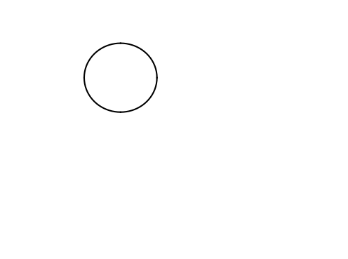
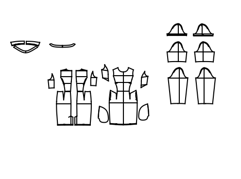

# Example1

# Example2


# Usage - Per File
```python
from extractors import extract_dxf
from drawer import Drawer

drawer = Drawer()
drawer.setCanvas(-1500, 2500, -1000, 2000, no_axis=True)

with open('file_name.dxf', 'r') as doc:
    drawer = extract_dxf(doc, drawer)

drawer.plot()
drawer.save("file_name.png")
```


# Usage - Per Block
```python
from extractors import *
from drawer import Drawer

with open('file_name.dxf', 'r') as doc:
    while True:
        drawer = Drawer()
        drawer.setCanvas(-1500, 2500, -1000, 2000, no_axis=True)    
        line = extract_line(doc)
        if line == 'EOF':
            break
        if line == 'BLOCK':
            blk = extract_block(doc)
            drawer.add(blk)
            drawer.plot()
            drawer.save("file_name.png")
```
